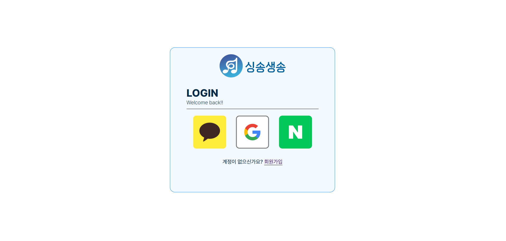
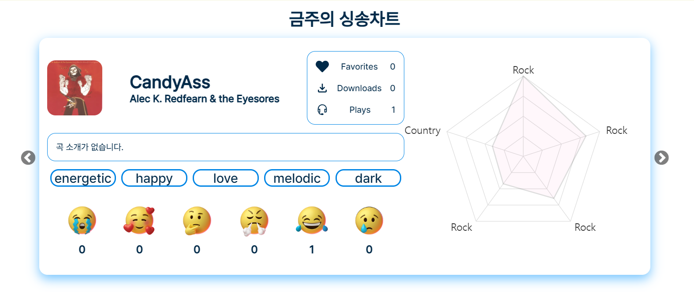
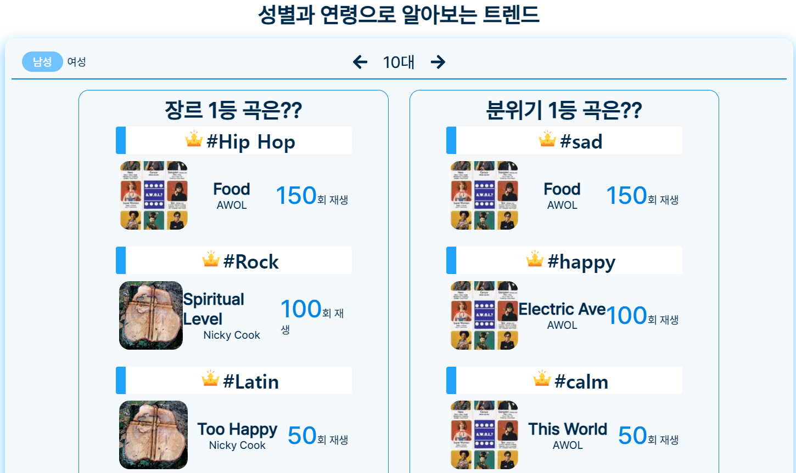
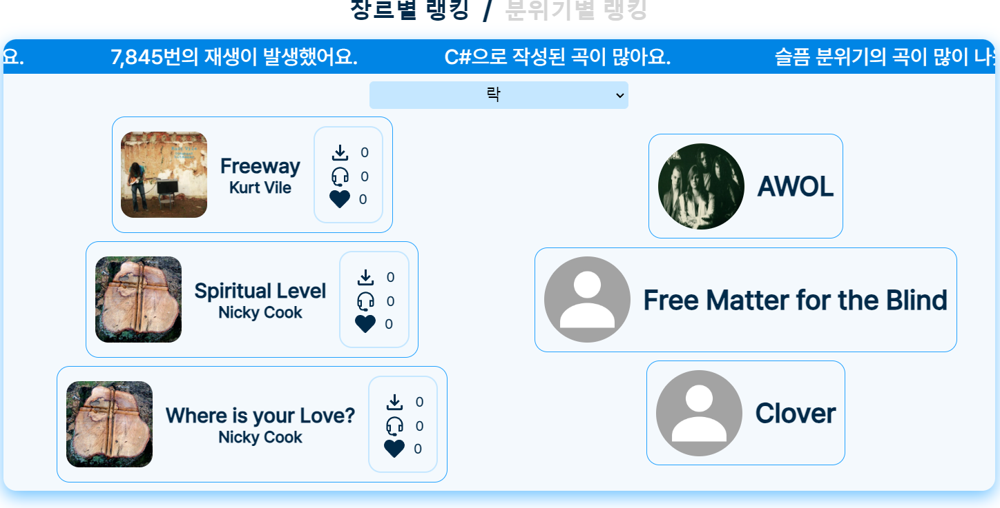
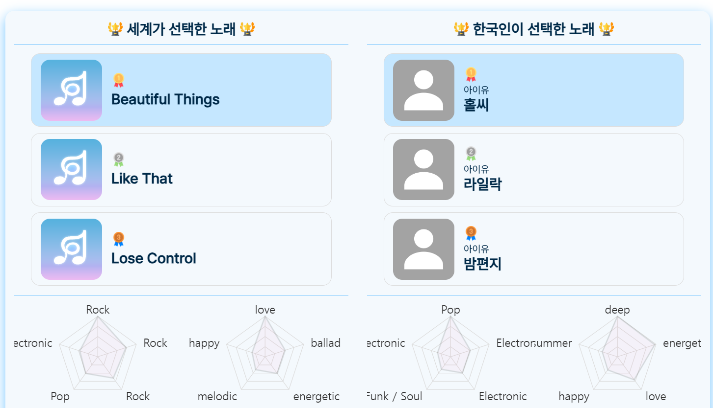
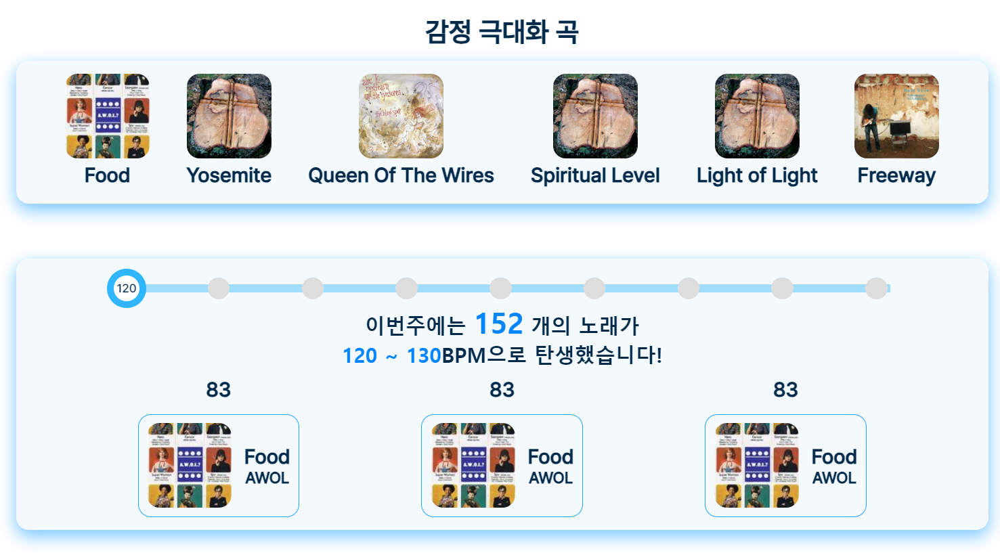
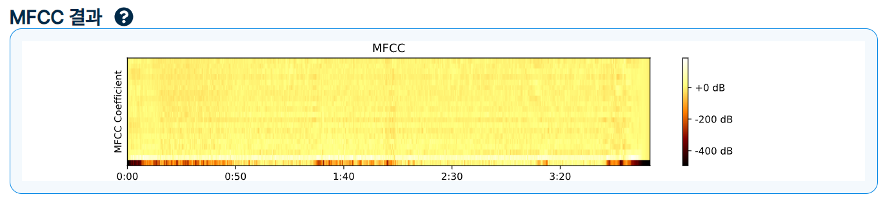
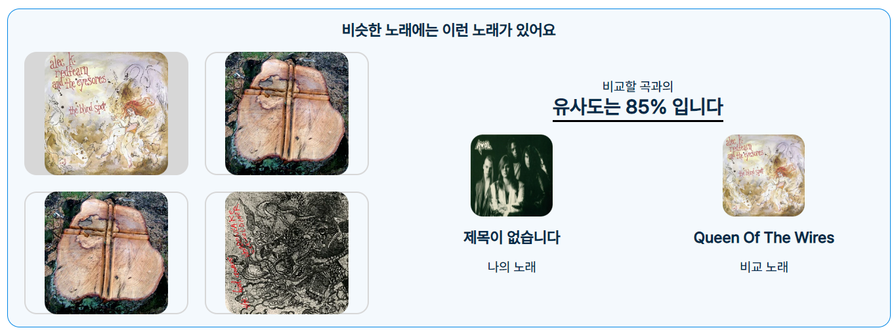

# SSAFY 10기 부울경 2반 E206 / FRONTEND

## 폴더 구조
📂components -> 컴포넌트들을 관리하는 폴더  
📂navigation -> router를 관리하는 파일이 있는 폴더  
📂pages -> 페이지들을 관리하는 폴더  
┣ 📂layout -> 페이지의 레이아웃을 관리하는 폴더  
┗ 📂root ->  페이지를 관리하는 폴더  
📂sources -> 공통적으로 사용하는 소스들을 관리하는 폴더  

📦src  
 ┣ 📂components  
 ┃ ┣ 📂auth -> 인증관련 입력을 관리하는 폴더  
 ┃ ┣ 📂buttons  
 ┃ ┣ 📂modal  
 ┃ ┣ 📂moodTag  
 ┃ ┣ 📂musicPlayer  
 ┃ ┣ 📂pageComponents  ->  특정 페이지의 컴포넌트  
 ┃ ┃ ┣ 📂artistpageComponent  
 ┃ ┃ ┣ 📂discoverpageCompnent  
 ┃ ┃ ┣ 📂postPageComponent  
 ┃ ┃ ┣ 📂songDetailpageComponent  
 ┃ ┃ ┗ 📂trendpageComponent  
 ┃ ┃   ┗ 📂testComponent  
 ┃ ┣ 📂public  
 ┃ ┃ ┣ 📂analysis  
 ┃ ┃ ┣ 📂chart  
 ┃ ┃ ┃ ┣ 📂barChart  
 ┃ ┃ ┃ ┗ 📂raderChart  
 ┃ ┃ ┣ 📂comment  
 ┃ ┃ ┣ 📂emotionBox  
 ┃ ┃ ┗ 📂music  
 ┃ ┣ 📂sidebar  ->  메인화면에 노출 될 사이드바  
 ┃ ┗ 📂test  
 ┣ 📂hooks  ->  axios와 input hook 관리 폴더  
 ┃ ┣ 📂api  
 ┃ ┗ 📜useInput.ts    
 ┣ 📂navigation  ->  router관리 폴더  
 ┃ ┗ 📜router.jsx  
 ┣ 📂pages  
 ┃ ┣ 📂Error  -> 에러 페이지 레이아웃  
 ┃ ┣ 📂layout  ->  회원정보 및 메인페이지 레이아웃  
 ┃ ┗ 📂root  ->  페이지 컴포넌트를 관리하는 폴더  
 ┣ 📂sources  
 ┃ ┣ 📂font  
 ┃ ┣ 📂imgs    
 ┃ ┃ ┣ 📂auth    
 ┃ ┃ ┣ 📂emotions    
 ┃ ┃ ┣ 📂header  
 ┃ ┃ ┣ 📂playList  
 ┃ ┃ ┣ 📂title  
 ┃ ┣ 📂mp3  
 ┃ ┗ 📂testimg  
 ┣ 📂store  
 ┃ ┣ 📜index.ts    
 ┃ ┣ 📜musicSlice.ts  
 ┃ ┗ 📜userSlice.ts    
 ┗ 📂utils  
   ┣ 📂api  
   ┣ 📜cookie.ts    
   ┣ 📜dateUtils.ts    
   ┣ 📜ScrollToTop.tsx    
   ┣ 📜types.ts    
   ┗ 📜validator.ts    

## 페이지 구성

### 1.초기진입 로그인 화면

### 2.메인페이지 컴포넌트
1. 금주의 싱송차트

2. 성별과 연령으로 알아보는 트렌드 

3. 장르별 분위기별 

4. 빌보드 / 멜론 인기차트 표시 컴포넌트

5. 감정 극대화 곡 및 BPM

### 3. 분석 페이지
1. 업로드 페이지

2. MFCC 이미지

3. 구간 분석 결과

4. 유사곡 
